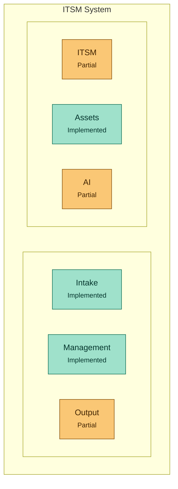

# ITSM System with AI-Powered Triage

🌐 [Ler em Português](./README.md)

Personal portfolio project: a complete IT ticketing and management system (ITSM), with AI-powered triage built in from the first user interaction — not bolted on afterward. Reuses the classification logic already validated in the [AIOps Copilot](https://github.com/natanmcardoso) project.

> Not intended for sale. Goal: demonstrate the ability to build a complete product (backend, frontend, database, and applied AI) as part of a career shift toward AI/automation.

---

## Current status

✅ Phase 1 completed and tested — data model + migrations
✅ Phase 2 completed and tested — core `tickets` endpoints (CRUD, no AI)
✅ Phase 3 completed and tested — AI triage wired into ticket creation (mock mode by default; live mode with Anthropic when `ANTHROPIC_API_KEY` is set)
✅ Phase 4.0 completed and tested — authentication (login + JWT), a prerequisite for Phase 4 (frontend)
✅ Phase 4 (frontend) completed and tested — technician queue, new ticket, and manager dashboard, including the SLA and resolve-by-user sub-phases: all 4 headline metrics from the design doc (§2.3) now have real data
✅ Custom visual identity applied across all 4 screens — blue sidebar, Plus Jakarta Sans typeface, priority/status badges (design process documented in `CLAUDE.md`)
✅ Ticket detail screen — technician can assign, change status/priority/category, and log history entries, straight from the UI
✅ Ticket tracking (end user) + KB search (technician) — close the design doc's last remaining gaps (§2.1/§2.2)
✅ Phase 5 (Navigation & Discovery) completed and tested — queue filters/search, a clickable dashboard, and all 4 screens made responsive (Tailwind breakpoints + a mobile drawer sidebar)
✅ Phase 6 (CMDB + Problem Management) completed and tested — `assets`/`problems` tables, seed data linking tickets to both, dashboard showing "N tickets linked" per asset/problem (no dedicated CRUD screen, by design)
✅ Phase 8 (Queue tweaks, wider search, editable KB) completed and tested — clickable priority cards, "My tickets"/"General queue" as their own sidebar tabs, search by requester/technician name, creating and editing knowledge-base articles
✅ Phase 9 (Customizable ticket table) completed and tested — opened-date and SLA columns, clickable sortable headers, a column-visibility picker (choice saved per browser)

---

## Stack

- **Backend:** FastAPI (Python)
- **Frontend:** React (Vite + TypeScript, React Router, Tailwind CSS)
- **Database:** PostgreSQL (hosted on [Neon](https://neon.tech))
- **AI:** triage service reused from the AIOps Copilot project

---

## Personas

- **End user** — opens tickets, gets automatic AI suggestions (category, priority, knowledge base article)
- **Technician (L1/L2)** — handles a queue already triaged by AI, can reclassify
- **Manager/supervisor** — tracks SLA dashboard, volume, and AI impact (% resolved without human intervention)

---

## Architecture

The system is organized into 6 domains — 3 flow-oriented (how a ticket comes in, is managed, and goes out) and 3 domain-oriented (what the system covers on each front):



- **Intake** — portal (new ticket) and REST API
- **Management** — queue, SLA, AI-suggested priority, status workflow, problem-based escalation
- **Output** — resolution via AI suggestion, knowledge base (rule-based automation and notifications not yet implemented)
- **ITSM** — incident, request, problem (change/release/catalog out of scope, portfolio-scope decision)
- **Assets** — basic CMDB (Phase 6)
- **AI** — classification, category routing, KB suggestion (chatbot and sentiment analysis out of scope, portfolio-scope decision)

---

## Roadmap

- [x] Phase 1 — Data model + migrations
- [x] Phase 2 — Core `tickets` endpoints (CRUD, no AI yet)
- [x] Phase 3 — AI triage integration
- [x] Phase 4.0 — Authentication (login + JWT)
- [x] Phase 4 — Frontend (technician queue → new ticket → manager dashboard)
  - [x] Technician queue
  - [x] New ticket
  - [x] Manager dashboard
- [x] Phase 5 — Navigation & Discovery
  - [x] Filters (status, priority, category, technician) + text search on the technician queue
  - [x] Clickable dashboard (metrics become links to an already-filtered queue)
  - [x] Responsive (Tailwind breakpoints; sidebar becomes a mobile drawer)
- [x] Phase 6 — CMDB + Problem Management (ITIL alignment)
- [x] Phase 8 — Queue tweaks, wider search, editable KB
  - [x] Clickable priority cards on the queue
  - [x] "My tickets" and "General queue" as their own tabs on the technician sidebar
  - [x] Search by requester/technician name in `GET /tickets?query=`
  - [x] Creating and editing knowledge-base articles
- [x] Phase 9 — Customizable ticket table
  - [x] Opened-date and SLA columns
  - [x] Clickable sortable headers
  - [x] Column-visibility picker (saved per browser)
- [ ] Phase 7 (future) — Custom RMM integration (endpoint agent, inventory, remote access)

Full technical design (flows, data model, API contract): [`design-itsm-mvp.md`](./design-itsm-mvp.md)

---

## Running locally

```bash
git clone https://github.com/natanmcardoso/SistemaITSM.git
cd SistemaITSM

# create a .env in the project root with:
# DATABASE_URL=postgresql://<user>:<password>@<host>.sa-east-1.aws.neon.tech/neondb?sslmode=require
#
# optional — only needed for the AI triage live mode (Phase 3):
# ANTHROPIC_API_KEY=
# LLM_MODEL=claude-haiku-4-5
# Without ANTHROPIC_API_KEY, triage runs in mock mode (local heuristic, no API cost).
#
# required starting from Phase 4.0 — secret used to sign login JWTs:
# JWT_SECRET=<generate with: python -c "import secrets; print(secrets.token_urlsafe(48))">


cd backend
python -m venv .venv
.venv/Scripts/activate          # Windows (use .venv/bin/activate on Linux/Mac)
pip install -r requirements.txt

# applies the schema to the database (users, categories, tickets, interactions, kb_articles, sla_rules)
python -m alembic upgrade head

# runs the Phase 1 test (inserts and queries test records, then cleans up)
python test_phase1_data_model.py

# starts the API
python -m uvicorn app.main:app --reload
# interactive docs at http://127.0.0.1:8000/docs

# runs the Phase 2 test (ticket CRUD via the real API, then cleans up)
python test_phase2_tickets_api.py

# runs the Phase 3 test (AI triage via the real API, mock mode by default, then cleans up)
python test_phase3_ai_triage.py

# runs the Phase 4.0 test (login + JWT via the real API, then cleans up)
python test_phase4_0_auth.py

# runs the manager dashboard + /tickets auth guard test (Phase 4, screen
# 3/3), via the real API, then cleans up
python test_phase4_dashboard.py

# runs the SLA test (sla_due_at calculation + breach metric on the
# dashboard), via the real API, then cleans up
python test_phase4_sla.py

# runs the resolve-by-user test (KB by category + user closing their own
# ticket via the AI suggestion), via the real API, then cleans up
python test_phase4_resolve_by_user.py

# runs the interaction-history test (ticket detail screen), via the real
# API, then cleans up
python test_phase4_interactions.py

# runs the requester_id filter test (ticket tracking) and the KB text
# search test, via the real API, then clean up
python test_phase4_meus_chamados.py
python test_phase4_kb_search.py

# runs the filters/search test (category_id + query) and the SLA-breached
# filter test on GET /tickets (Phase 5), via the real API, then clean up
python test_phase5_ticket_filters.py
python test_phase5_sla_filter.py

# runs the CMDB + Problem Management data model test (Phase 6): creates an
# asset/problem, links them to a ticket, checks persistence, then cleans up
python test_phase6_cmdb_data_model.py

# seeds the database with persistent dev data (users, categories, sla_rules,
# kb_articles, assets, problems, sample tickets) — needed so the frontend's
# screens have something to show. Idempotent, safe to re-run. Password for
# every seeded account: demo1234
python scripts/seed_dev_data.py

# runs the tests that read the seed's result above (create/delete nothing):
# asset/problem-to-ticket links, and the top_assets/top_problems dashboard
# metrics
python test_phase6_cmdb_seed.py
python test_phase6_dashboard.py

# runs the Phase 8 tests: search by requester/technician name in
# GET /tickets, and the KB article CRUD (create/edit, technician-only),
# via the real API, then clean up
python test_phase8_search_by_name.py
python test_phase8_kb_crud.py
```

### Frontend (Phase 4)

```bash
cd frontend
npm install

# create frontend/.env (points to the local API)
cp .env.example .env

npm run dev
# http://localhost:5173/login — pick an account (technician, end user, or
# manager; password demo1234 is filled in automatically)
# - technician lands on the queue (seeded tickets)
# - end user lands directly on the new ticket screen
# - manager lands directly on the dashboard
```

> No `GET /users`/`GET /categories` endpoint in this phase (design decision) —
> the names shown in the queue come from a manual mirror of the seed data in
> `frontend/src/devData.ts`. If you run `seed_dev_data.py` against a fresh
> database, the UUIDs change and that file needs to be updated by hand.

### Available endpoints

```
GET    /health
POST   /auth/login                  → login (email + password) → JWT
GET    /auth/me                     → authenticated user's data (requires Bearer token)
POST   /tickets                     → creates a ticket (AI triage runs automatically) — requires login
GET    /tickets                     → list (filters: status, priority, category_id, assignee_id, requester_id, query, sla=breached) — requires login
GET    /tickets/{id}                → detail + interaction history — requires login
PATCH  /tickets/{id}                → updates status/priority/category_id/assignee_id — requires login
POST   /tickets/{id}/interactions   → logs a history entry on the ticket — requires login
POST   /tickets/{id}/resolve-by-user → user closes their own ticket via the AI suggestion — requires login (requester only)
GET    /kb-articles                 → lists/searches KB articles (optional ?category_id= and ?query= filters) — requires login
GET    /kb-articles/{id}            → detail for one article — requires login
POST   /kb-articles                 → creates an article — requires login with role=technician
PATCH  /kb-articles/{id}            → edits an article (partial) — requires login with role=technician
GET    /dashboard/summary           → manager dashboard metrics — requires login with role=manager
```

### AI triage (Phase 3)

- On ticket creation (`POST /tickets`), the title + description are sent to the triage service, which suggests `priority` (severity) and `category_id` (matched against already-registered categories — if none match, it stays null instead of creating a new category).
- The suggestion is always saved to `ai_suggested_priority` / `ai_suggested_category_id`, kept separate from the final value (`priority` / `category_id`) — that's what makes it possible to measure AI accuracy later (design-itsm-mvp.md §5).
- If `priority`/`category_id` aren't provided at creation time, the AI's suggestion becomes the ticket's initial value (editable later via `PATCH`). If they are provided explicitly, they take precedence — but the AI suggestion is still recorded.
- **Mock mode** (default, without `ANTHROPIC_API_KEY`): local keyword heuristic (`app/services/triage_mock.py`) — no external API call, used by the automated tests.
- **Live mode** (with `ANTHROPIC_API_KEY` set): calls Anthropic (Claude), reusing the prompt/parse/retry/fallback pattern validated in [AIOps Copilot](https://github.com/natanmcardoso).

### Authentication (Phase 4.0)

- Email/password login (`POST /auth/login`) returns a JWT (HS256, expires in 8h) plus the user's data (`id`, `name`, `email`, `role`).
- Endpoints that require login use the `Authorization: Bearer <token>` header; `GET /auth/me` is the reference endpoint for validating a token.
- **There's no public user signup in this phase** — accounts are created directly in the database (password hashed with bcrypt via `app.security.hash_password`). A signup endpoint is left for a future phase, if needed.
- The `tickets` endpoints have required authentication since Phase 4, screen 3/3 (any logged-in user, no role restriction) — `GET /dashboard/summary` goes further and restricts to `role=manager` via `require_role`.

### Technician queue (Phase 4, screen 1/3)

- Login (`POST /auth/login`) via a simple technician picker — no password field, the seeded accounts' password (`demo1234`) is filled in automatically.
- The queue (`GET /tickets`) is split into "My tickets" (assigned to the logged-in technician) and "General queue — unassigned", sorted by AI-suggested priority.
- Each row shows the final priority and, when the technician reclassified it, the AI's original suggestion alongside it — a direct view of the data that feeds the AI-accuracy metric (design-itsm-mvp.md §5).
- Backend has `CORSMiddleware` allowing `http://localhost:5173` (the only dev origin permitted).
- Each queue row is clickable and opens the ticket detail screen (see the dedicated section below).

### New ticket (Phase 4, screen 2/3)

- End-user flow (design-itsm-mvp.md §2.1): a form with title + description, `POST /tickets` sends the logged-in user's `requester_id` and triggers AI triage automatically.
- After creation, fetches `GET /kb-articles?category_id=` for the ticket's final category; if an article is found, shows the suggestion with "Resolved, close it" (calls `resolve-by-user`) / "Didn't resolve it" — see the dedicated section below. No article for that category, and it skips straight to the confirmation (category/priority the AI suggested).
- Login extended: the same account picker used on the queue screen now also lists the seeded end users (João Pereira, Marina Alves); the post-login destination is decided by `role` (`end_user` → `/novo-chamado`, `technician` → `/fila`).

### Manager dashboard (Phase 4, screen 3/3)

- `GET /dashboard/summary` (restricted to `role=manager`) returns ticket volume by status, top categories, SLA breaches, % resolved by AI, and the AI's triage accuracy — suggested vs. final value of `priority`/`category_id` (design-itsm-mvp.md §5), counting only tickets where the AI actually suggested something. All 4 of the design doc's headline metrics (§2.3) now have real data.
- Auth guard wired into `/tickets` as part of this screen (a Phase 4.0 debt that was still open): any logged-in user can call it, no role restriction.
- Login extended again: the picker now also lists Beatriz Lima (manager); logging in as manager lands directly on `/dashboard`.

### SLA (Phase 4, sub-phase after screen 3/3)

- `sla_rules` seeded (`scripts/seed_dev_data.py`) with 4 priorities — `resolution_time_hours`: critical=4h, high=8h, medium=24h, low=72h.
- `sla_due_at` is computed on `POST /tickets` (creation) and recomputed on `PATCH /tickets/{id}` whenever `priority` changes — but based on `created_at`, not the moment of the PATCH, so reclassifying priority can't "reset the clock" on the SLA.
- The dashboard shows tickets with a breached SLA (`sla_due_at` in the past + status still open).

### Resolve-by-user (Phase 4, sub-phase after SLA)

- Closes the dashboard's last gap: `% resolved by AI` — the project's central differentiator metric (design-itsm-mvp.md §2.3).
- **Scope simplification:** the design doc (§5) imagines the triage AI already returning the suggested article along with category/priority. Here the suggestion is matched by `category_id` (`kb_articles` seeded with 1 article per category), without involving the AI in this step — doesn't touch the triage service, which is already closed and tested.
- `GET /kb-articles?category_id=` (also covers `GET /kb-articles/{id}`) lists the articles for the ticket's category.
- `POST /tickets/{id}/resolve-by-user`: only the ticket's `requester_id` can call it (403 otherwise) and only while `status == "open"` (400 otherwise) — sets `status=resolved` + `resolved_by_ai=true`.
- The dashboard gained a highlighted `% resolved by AI, no technician` card, at the top of the page.

### Visual redesign (Phase 4, after resolve-by-user)

- All 4 screens (login, queue, new ticket, dashboard) got their own visual identity — blue sidebar, Plus Jakarta Sans typeface, priority/status badges. Purely visual, no logic changes.
- Process documented in `CLAUDE.md`: started from reference screenshots the user brought in, validated through a design canvas (2 rounds — one direction that looked "too close to the reference," then 3 genuinely different directions) before becoming real code.

### Ticket detail screen (Phase 4, after visual redesign)

- Closes the biggest remaining functional gap: until now, the frontend only read data — it never called `PATCH /tickets/{id}` or created an interaction, even though those endpoints already existed.
- New `/tickets/{id}` route (queue rows became clickable). The technician can: assign the ticket to themselves, change status/priority/category (a single `PATCH`), and log updates to the history (`POST /tickets/{id}/interactions`).
- Reassignment is "to myself" only (no picker for other technicians — there's no `GET /users`). Interactions are plain text only, no edit/delete/attachments.

### Ticket tracking + KB search (Phase 4, closes the design doc's last remaining gaps)

- **End-user ticket tracking (§2.1):** new `/meus-chamados` screen — lists the user's own tickets (`GET /tickets?requester_id=`), clickable to open the detail view. `NewTicketPage` gained a "Meus chamados" link in the header.
- **KB search for technicians (§2.2):** new `/base-conhecimento` screen — free-text search (`GET /kb-articles?query=`, case-insensitive substring on title or content) plus a category filter. The technician's sidebar now has both real items (Fila de chamados + Base de conhecimento).
- `TicketDetailPage` now serves both personas from the same component: technicians see the sidebar + action panel; end users see a read-only view (info + AI suggestion + history), with no sidebar and no action panel.
- With this, there's no known gap left from the original design doc (§2).

### Queue filters and search (Phase 5 — Navigation & Discovery)

- `GET /tickets` gained `category_id` and `query` (case-insensitive substring search on title/description), added to the filters that already existed (`status`, `priority`, `assignee_id`, `requester_id`).
- The technician queue got a filter bar (status, priority, category, technician) plus text search, with state persisted in the URL (`?status=&priority=&category=&assignee=&q=`) — the filtered view is copy/paste-able as a link.
- With no filter active, the queue behaves exactly as before (open/in-progress tickets, split into "My tickets" / "General queue — unassigned"). With any filter or search active, it switches to a single "Filtered results" list, which can cut across both groups (e.g. `status=resolved`).

### Clickable dashboard (Phase 5 — Navigation & Discovery)

- `GET /tickets` gained `sla=breached` — the same breach definition used by `GET /dashboard/summary.sla` (deadline in the past + status still open).
- On the manager dashboard, every metric now links to an already-filtered queue: the status pills (`Aberto`, `Em andamento`...) link to `/fila?status=`, each entry under "Top categories" links to `/fila?category=`, and the "SLA breached" card links to `/fila?sla=breached` (only when there's at least one breached ticket — no dead link).

### Responsive (Phase 5 — Navigation & Discovery)

- `Sidebar.tsx` (queue, dashboard, knowledge base, ticket detail — technician) collapses below `1024px` wide into a compact topbar with a menu button, which opens the same navigation as a slide-in drawer — no more fixed 256px sidebar eating up a phone screen.
- The remaining screens (login, new ticket, my tickets, ticket detail — end user) got responsive padding and headers.

### CMDB + Problem Management (Phase 6)

- Two new tables: `assets` (name, type, status, owner, serial number) and `problems` (title, root cause, status) — `tickets` gains `asset_id`/`problem_id`, both optional and independent of each other.
- **No dedicated CRUD screen in this phase** (scope decision — cover ITIL's core well instead of replicating the framework's 34+ practices): assets/problems are seeded via `scripts/seed_dev_data.py` and linked to existing tickets just to feed the dashboard.
- `GET /dashboard/summary` gained `top_assets`/`top_problems` — "N tickets linked to this asset/problem" — shown in 2 new cards on the manager dashboard.

### Queue tweaks, wider search, editable KB (Phase 8)

- **Clickable priority cards:** on the technician queue, each "open tickets by priority" card becomes a quick `?priority=` filter shortcut, on the same screen.
- **"My tickets" and "General queue" as their own tabs:** used to be two stacked sections on a single screen; now they're two routes with a dedicated sidebar item each (`/meus-atendimentos` and `/fila`), reusing the same queue+filters component (`TicketQueueBoard`). The "Technician" filter that existed in the filter bar was removed — the scope is already fixed per tab.
- **Search by name:** `GET /tickets?query=` now also matches the requester's or assignee's name (in addition to title/description, which already worked since Phase 5).
- **KB article CRUD:** `POST /kb-articles` (create) and `PATCH /kb-articles/{id}` (edit), restricted to `role=technician`. No delete. The knowledge base screen gained a "New article" button and an edit icon on each card, with an inline form.

### Customizable ticket table (Phase 9)

- **New columns:** "Opened on" and "SLA" on the "My tickets"/"General queue" table — SLA shows "(breached)" in red when the deadline has passed and the ticket is still open.
- **Sort by column:** clicking a header sorts by that column; clicking again flips the direction (▲/▼). With no click, the list stays sorted by priority, as before.
- **Pick your own visible columns:** a "Columns" button above the table lets you hide any combination of columns (at least 1 always stays visible) — the choice is saved in the browser and applies to both screens.

---

## License

Personal study/portfolio project.
