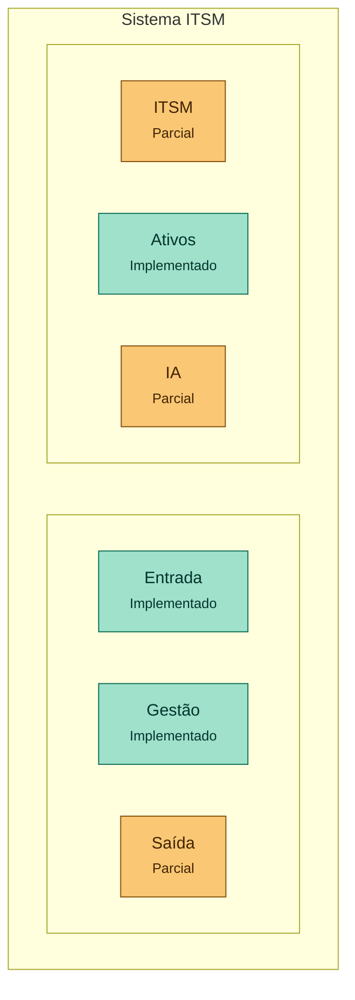

# Sistema ITSM com IA de Triagem

🌐 [Read in English](./README.en.md)

Projeto de portfólio pessoal: um sistema de chamados e gerenciamento de TI (ITSM) completo, com IA de triagem nativa desde o primeiro contato do usuário — não como um recurso adicionado depois. Reaproveita a lógica de classificação já validada no projeto [AIOps Copilot](https://github.com/natanmcardoso).

> Sem foco em venda. Objetivo: demonstrar capacidade de construir um produto completo (backend, frontend, banco de dados e IA aplicada) como parte da virada de carreira para IA/automação.

---

## Status atual

✅ Fase 1 concluída e testada — modelo de dados + migrations
✅ Fase 2 concluída e testada — endpoints core de `tickets` (CRUD, sem IA)
✅ Fase 3 concluída e testada — triagem por IA plugada na criação de chamados (modo mock por padrão; live com Anthropic quando `ANTHROPIC_API_KEY` estiver configurada)
✅ Fase 4.0 concluída e testada — autenticação (login + JWT), pré-requisito da Fase 4 (frontend)
✅ Fase 4 (frontend) concluída e testada — fila do técnico, novo chamado e dashboard do gestor, incluindo as sub-fases de SLA e resolve-by-user: as 4 métricas centrais do design doc (§2.3) têm dado real no dashboard
✅ Identidade visual própria aplicada nas 4 telas — sidebar azul, tipografia Plus Jakarta Sans, badges por prioridade/status (processo de design documentado no `CLAUDE.md`)
✅ Tela de detalhe do chamado — técnico consegue atribuir, mudar status/prioridade/categoria e registrar histórico, direto pela UI
✅ Acompanhamento do chamado (usuário final) + busca de KB (técnico) — fecham os últimos gaps do design doc (§2.1/§2.2)
✅ Fase 5 (Navegação e Descoberta) concluída e testada — filtros + busca na fila, dashboard clicável e as 4 telas responsivas (breakpoints Tailwind + sidebar em drawer no mobile)
✅ Fase 6 (CMDB + Problem Management) concluída e testada — tabelas `assets`/`problems`, seed vinculando chamados a ambos, dashboard mostrando "N chamados vinculados" por ativo/problema (sem tela de CRUD dedicada, por design)
✅ Fase 8 (Ajustes de fila, busca ampliada e KB editável) concluída e testada — cards de prioridade clicáveis, "Meus chamados"/"Fila geral" em abas próprias na sidebar, busca por nome de solicitante/técnico, criação e edição de artigos da base de conhecimento
✅ Fase 9 (Tabela de chamados customizável) concluída e testada — colunas de data de abertura e SLA, cabeçalhos clicáveis pra ordenar, seletor de colunas visíveis (escolha salva por navegador)
✅ Fase 10 (Configurações restantes) concluída e testada — CRUD de categorias, edição de regras de SLA e nova tela `/configuracoes` pra técnico/gestor
✅ Fase 11 (Administração) concluída e testada — 4ª persona (`admin`), CRUD de usuários e grupos, trilha de auditoria, nova tela `/admin`
✅ Fase 12 (Catálogo de Serviços + Serviços) concluída e testada — tabela `services`, aba "Serviços" em Configurações, nova tela `/catalogo` pro usuário final escolher um serviço ao abrir chamado (pré-seleciona a categoria)
✅ Fase 13 (Calendários — SLA por horário comercial) concluída e testada — a fase de maior risco do roadmap: `sla_due_at` agora é calculado em horário comercial (1 calendário global com feriados), não mais corrido 24/7; aba "Calendários" em Configurações; chamados já existentes recalculados via backfill
✅ Fase 14 (Dashboard expandido + Página inicial + Menu do usuário) concluída e testada — dashboard novo do técnico, produtividade por técnico no dashboard do gestor, tela `/inicio` com atalhos por persona, menu do usuário (Perfil, Prioridades, Minha fila, Agendas)
✅ Fase 15 (Relatórios) concluída e testada — exportação CSV/PDF do resumo do dashboard e da lista de chamados, disponível pra gestor e técnico, sem endpoint novo (PDF via impressão do navegador)
✅ Fase 16 (Automações) concluída e testada — regra "chamado perto de estourar o SLA" (limiar editável), notificação dentro do próprio sistema (sem e-mail/SMS), calculada sob demanda sem tabela persistida nem scheduler em background
✅ Fase 17 (Monitoramento) concluída e testada — saúde do próprio sistema: uptime desde o último restart + taxa de erro via log persistido de requisições, restrito ao gestor. Fecha o roadmap estendido de navegação (Fases 10-17); só resta a Fase 18 (RMM próprio, futura, fora de escopo)

---

## Stack

- **Backend:** FastAPI (Python)
- **Frontend:** React (Vite + TypeScript, React Router, Tailwind CSS)
- **Banco de dados:** PostgreSQL (hospedado na [Neon](https://neon.tech))
- **IA:** serviço de triagem reaproveitado do AIOps Copilot

---

## Personas

- **Usuário final** — abre chamados, recebe sugestão automática da IA (categoria, prioridade, artigo da base de conhecimento)
- **Técnico (N1/N2)** — atende fila já triada pela IA, pode reclassificar
- **Gestor/supervisor** — acompanha dashboard de SLA, volume e impacto da IA (% resolvido sem intervenção humana)
- **Admin** (Fase 11) — gerencia usuários, grupos e consulta a trilha de auditoria; "perfil" continua sendo o `role` fixo, sem sistema de permissões granular

---

## Arquitetura

O sistema é organizado em 6 domínios — 3 de fluxo (como um chamado entra, é gerido e sai) e 3 de domínio (o que o sistema cobre em cada frente):



- **Entrada** — portal (novo chamado) e API REST
- **Gestão** — fila, SLA, prioridade sugerida por IA, workflow de status, escalonamento por problema
- **Saída** — resolução via sugestão da IA, base de conhecimento (automação por regras e notificações ainda não implementadas)
- **ITSM** — incidente, requisição, problema, catálogo de serviços (Fase 12) (mudança/release fora de escopo, decisão de portfólio)
- **Ativos** — CMDB básico (Fase 6)
- **IA** — classificação, roteamento por categoria, sugestão de KB (chatbot e análise de sentimento fora de escopo, decisão de portfólio)

---

## Roadmap

- [x] Fase 1 — Modelo de dados + migrations
- [x] Fase 2 — Endpoints core de `tickets` (CRUD, sem IA)
- [x] Fase 3 — Integração com IA de triagem
- [x] Fase 4.0 — Autenticação (login + JWT)
- [x] Fase 4 — Frontend (fila do técnico → novo chamado → dashboard)
  - [x] Fila do técnico
  - [x] Novo chamado
  - [x] Dashboard do gestor
- [x] Fase 5 — Navegação e Descoberta
  - [x] Filtros (status, prioridade, categoria, técnico) + busca por texto na fila do técnico
  - [x] Dashboard clicável (métricas viram links pra fila já filtrada)
  - [x] Responsivo (breakpoints Tailwind nas telas; sidebar vira drawer no mobile)
- [x] Fase 6 — CMDB + Problem Management (alinhamento ITIL)
- [x] Fase 8 — Ajustes de fila, busca ampliada e KB editável
  - [x] Cards de prioridade clicáveis na fila
  - [x] "Meus chamados" e "Fila geral" em abas próprias na sidebar do técnico
  - [x] Busca por nome de solicitante/técnico em `GET /tickets?query=`
  - [x] Criação e edição de artigos da base de conhecimento
- [x] Fase 9 — Tabela de chamados customizável
  - [x] Colunas de data de abertura e SLA
  - [x] Cabeçalhos clicáveis pra ordenar
  - [x] Seletor de colunas visíveis (persistido por navegador)
- [x] Fase 10 — Configurações restantes
  - [x] CRUD de categorias (criar, listar, editar)
  - [x] Edição de regras de SLA
  - [x] Tela `/configuracoes`, restrita a técnico/gestor
- [x] Fase 11 — Administração
  - [x] 4ª role, `admin`, no enum `user_role`
  - [x] `groups`/`user_groups` (organização/roteamento, não controla permissão) + `audit_log`
  - [x] CRUD de usuários e grupos, trilha de auditoria (só leitura)
  - [x] Tela `/admin`, restrita a admin
- [x] Fase 12 — Catálogo de Serviços + Serviços
  - [x] Tabela `services` (nome, categoria, descrição)
  - [x] `GET/POST/PATCH /services`; `POST /tickets` herda a categoria do serviço quando não vem explícita
  - [x] Aba "Serviços" em Configurações; tela `/catalogo` pro usuário final
- [x] Fase 13 — Calendários (SLA por horário comercial)
  - [x] Tabelas `business_hours` (1 linha por dia da semana) e `holidays`
  - [x] `sla_due_at` calculado em horário comercial (fuso fixo América/São Paulo), com feriados
  - [x] `GET/PATCH /business-hours`, `GET/POST/DELETE /holidays`; aba "Calendários" em Configurações
  - [x] Backfill dos chamados já existentes com a nova lógica
- [x] Fase 14 — Dashboard expandido + Página inicial + Menu do usuário
  - [x] Dashboard pessoal do técnico (`/meu-dashboard`); produtividade por técnico no dashboard do gestor
  - [x] Página inicial (`/inicio`) com atalhos por persona — não substitui o destino de login por role
  - [x] Menu do usuário: Perfil (todas as personas), Minha fila/Prioridades/Agendas (técnico)
- [x] Fase 15 — Relatórios (exportação CSV/PDF)
  - [x] Resumo do dashboard e lista de chamados exportáveis em CSV
  - [x] Exportação em PDF via impressão do navegador (sem lib nova)
  - [x] Tela `/relatorios` disponível pra gestor e técnico (cada um exporta o próprio resumo)
- [x] Fase 16 — Automações
  - [x] Regra fixa "chamado perto de estourar o SLA" (limiar editável)
  - [x] Notificação dentro do sistema, calculada sob demanda (sem e-mail/SMS, sem scheduler)
  - [x] Tela `/automacoes`, restrita a gestor
- [x] Fase 17 — Monitoramento (saúde do sistema)
  - [x] Uptime desde o último restart do backend
  - [x] Log persistido de requisições (`request_logs`); taxa de erro e erros recentes numa janela de tempo
  - [x] Tela `/monitoramento`, restrita a gestor
- [ ] Fase 18 (futura) — RMM próprio integrado (agente de endpoint, inventário, acesso remoto)

Desenho técnico completo (fluxos, modelo de dados, contrato de API): [`design-itsm-mvp.md`](./design-itsm-mvp.md)

---

## Como rodar localmente

```bash
git clone https://github.com/natanmcardoso/SistemaITSM.git
cd SistemaITSM

# crie um .env na raiz com:
# DATABASE_URL=postgresql://<user>:<senha>@<host>.sa-east-1.aws.neon.tech/neondb?sslmode=require
#
# opcional — só necessário pro modo live da triagem por IA (Fase 3):
# ANTHROPIC_API_KEY=
# LLM_MODEL=claude-haiku-4-5
# Sem ANTHROPIC_API_KEY, a triagem roda em modo mock (heurística local, sem custo de API).
#
# obrigatório a partir da Fase 4.0 — segredo de assinatura dos JWTs de login:
# JWT_SECRET=<gere com: python -c "import secrets; print(secrets.token_urlsafe(48))">


cd backend
python -m venv .venv
.venv/Scripts/activate          # Windows (use .venv/bin/activate no Linux/Mac)
pip install -r requirements.txt

# aplica o schema no banco (users, categories, tickets, interactions, kb_articles, sla_rules)
python -m alembic upgrade head

# roda o teste da Fase 1 (insere e consulta registros de teste, depois limpa)
python test_phase1_data_model.py

# sobe a API
python -m uvicorn app.main:app --reload
# docs interativas em http://127.0.0.1:8000/docs

# roda o teste da Fase 2 (CRUD de tickets via API real, depois limpa)
python test_phase2_tickets_api.py

# roda o teste da Fase 3 (triagem por IA via API real, modo mock por padrão, depois limpa)
python test_phase3_ai_triage.py

# roda o teste da Fase 4.0 (login + JWT via API real, depois limpa)
python test_phase4_0_auth.py

# roda o teste do dashboard do gestor + guard de autenticação em /tickets
# (Fase 4, tela 3/3), via API real, depois limpa
python test_phase4_dashboard.py

# roda o teste de SLA (cálculo de sla_due_at + métrica de estouro no
# dashboard), via API real, depois limpa
python test_phase4_sla.py

# roda o teste de resolve-by-user (KB por categoria + usuário fechando o
# próprio chamado via sugestão da IA), via API real, depois limpa
python test_phase4_resolve_by_user.py

# roda o teste do histórico de interações (tela de detalhe do chamado),
# via API real, depois limpa
python test_phase4_interactions.py

# roda o teste do filtro requester_id (acompanhamento do chamado) e o da
# busca de KB por texto, via API real, depois limpam
python test_phase4_meus_chamados.py
python test_phase4_kb_search.py

# roda os testes de filtros/busca (category_id + query) e do filtro de SLA
# estourado em GET /tickets (Fase 5), via API real, depois limpam
python test_phase5_ticket_filters.py
python test_phase5_sla_filter.py

# roda o teste do modelo de dados de CMDB + Problem Management (Fase 6):
# cria asset/problem, vincula a um chamado, confere persistência, depois limpa
python test_phase6_cmdb_data_model.py

# popula o banco com dados de dev persistentes (usuários, categorias,
# sla_rules, kb_articles, assets, problems, chamados de exemplo) —
# necessário pras telas do frontend terem o que mostrar. Idempotente, pode
# rodar de novo sem duplicar. Senha de todas as contas: demo1234
python scripts/seed_dev_data.py

# roda os testes que leem o resultado do seed acima (não criam/apagam nada):
# vínculos de assets/problems com chamados, e as métricas top_assets/
# top_problems no dashboard
python test_phase6_cmdb_seed.py
python test_phase6_dashboard.py

# roda os testes da Fase 8: busca por nome de solicitante/técnico em
# GET /tickets, e o CRUD de artigos da KB (criar/editar, restrito a
# técnico), via API real, depois limpam
python test_phase8_search_by_name.py
python test_phase8_kb_crud.py
```

### Frontend (Fase 4)

```bash
cd frontend
npm install

# cria frontend/.env (aponta pra API local)
cp .env.example .env

npm run dev
# http://localhost:5173/login — escolha uma conta (técnico, usuário final ou
# gestor; senha demo1234 preenchida automaticamente)
# - técnico cai na fila (chamados semeados)
# - usuário final cai direto na tela de novo chamado
# - gestor cai direto no dashboard
```

> Sem endpoint `GET /users`/`GET /categories` nesta fase (decisão do design) — os
> nomes exibidos na fila vêm de um espelho manual do seed em `frontend/src/devData.ts`.
> Se rodar `seed_dev_data.py` num banco novo, os UUIDs mudam e esse arquivo precisa
> ser atualizado à mão.

### Endpoints disponíveis

```
GET    /health
POST   /auth/login                  → login (email + senha) → JWT
GET    /auth/me                     → dados do usuário autenticado (requer Bearer token)
POST   /tickets                     → cria chamado (triagem por IA roda automaticamente; service_id opcional herda a categoria do serviço) — requer login
GET    /tickets                     → lista (filtros: status, priority, category_id, assignee_id, requester_id, query, sla=breached) — requer login
GET    /tickets/{id}                → detalhe + histórico de interações — requer login
PATCH  /tickets/{id}                → atualiza status/priority/category_id/assignee_id — requer login com role=technician
POST   /tickets/{id}/interactions   → registra uma entrada de histórico no chamado — requer login com role=technician
POST   /tickets/{id}/resolve-by-user → usuário fecha o próprio chamado via sugestão da IA — requer login (só o solicitante)
GET    /kb-articles                 → lista/busca artigos da KB (filtros opcionais ?category_id= e ?query=) — requer login
GET    /kb-articles/{id}            → detalhe de um artigo — requer login
POST   /kb-articles                 → cria artigo — requer login com role=technician
PATCH  /kb-articles/{id}            → edita artigo (parcial) — requer login com role=technician
GET    /dashboard/summary           → métricas do dashboard do gestor (inclui produtividade por técnico) — requer login com role=manager
GET    /dashboard/my-summary        → métricas do dashboard pessoal do técnico — requer login com role=technician
GET    /categories                  → lista categorias — requer login com role=technician/manager
POST   /categories                  → cria categoria (barra nome duplicado, case-insensitive) — requer login com role=technician/manager
PATCH  /categories/{id}             → edita categoria (parcial) — requer login com role=technician/manager
GET    /services                    → lista serviços do catálogo — requer login
POST   /services                    → cria serviço — requer login com role=technician/manager
PATCH  /services/{id}               → edita serviço (parcial) — requer login com role=technician/manager
GET    /sla-rules                   → lista as 4 regras de SLA (uma por prioridade) — requer login com role=technician/manager
PATCH  /sla-rules/{id}               → edita prazos de resposta/resolução (parcial; priority não é editável) — requer login com role=technician/manager
GET    /business-hours              → lista os 7 dias do calendário — requer login com role=technician/manager
PATCH  /business-hours/{id}         → edita is_open/start_time/end_time de um dia — requer login com role=technician/manager
GET    /holidays                    → lista feriados — requer login com role=technician/manager
POST   /holidays                    → cria feriado (barra data duplicada) — requer login com role=technician/manager
DELETE /holidays/{id}               → remove feriado — requer login com role=technician/manager
GET    /users                       → lista usuários — requer login com role=admin
POST   /users                       → cria usuário (barra e-mail duplicado) — requer login com role=admin
PATCH  /users/{id}                  → edita usuário (parcial; só name/role) — requer login com role=admin
GET    /groups                      → lista grupos, com member_ids — requer login com role=admin
POST   /groups                      → cria grupo — requer login com role=admin
PATCH  /groups/{id}/members         → substitui o conjunto de membros por completo — requer login com role=admin
GET    /audit-log                   → lista a trilha de auditoria — requer login com role=admin
GET    /automation-rules            → lista a regra de automação (1 linha) — requer login com role=manager
PATCH  /automation-rules/{id}       → edita threshold_percent/enabled — requer login com role=manager
GET    /notifications               → lista chamados que dispararam a regra (calculado sob demanda) — requer login com role=manager
GET    /monitoring/summary          → uptime + taxa de erro (janela de tempo, ?window_hours=) — requer login com role=manager
```

### Triagem por IA (Fase 3)

- Ao criar um chamado (`POST /tickets`), o título + descrição são enviados ao serviço de triagem, que sugere `priority` (severidade) e `category_id` (casando com as categorias já cadastradas — se nenhuma bater, fica nulo, sem criar categoria nova).
- A sugestão é sempre salva em `ai_suggested_priority` / `ai_suggested_category_id`, separada do valor final (`priority` / `category_id`) — isso é o que permite medir o acerto da IA depois (design-itsm-mvp.md §5).
- Se `priority`/`category_id` não forem informados na criação, o valor sugerido pela IA vira o valor inicial do chamado (editável depois via `PATCH`). Se forem informados explicitamente, prevalecem — mas a sugestão da IA continua registrada.
- **Modo mock** (padrão, sem `ANTHROPIC_API_KEY`): heurística local por palavras-chave (`app/services/triage_mock.py`) — não chama API externa, usada nos testes automatizados.
- **Modo live** (com `ANTHROPIC_API_KEY` configurada): chama a Anthropic (Claude), reaproveitando o padrão de prompt/parse/retry/fallback validado no [AIOps Copilot](https://github.com/natanmcardoso).

### Autenticação (Fase 4.0)

- Login por email/senha (`POST /auth/login`) retorna um JWT (HS256, expira em 8h) e os dados do usuário (`id`, `name`, `email`, `role`).
- Endpoints que exigem login usam o header `Authorization: Bearer <token>`; `GET /auth/me` é o endpoint de referência para validar o token.
- **Não há cadastro público de usuário nesta fase** — contas são criadas direto no banco (senha com hash bcrypt via `app.security.hash_password`). Um endpoint de cadastro fica para uma fase futura, se necessário.
- Os endpoints de `tickets` exigem autenticação desde a Fase 4, tela 3/3 (qualquer usuário logado, sem restrição de role) — `GET /dashboard/summary` vai além e restringe a `role=manager` via `require_role`.

### Fila do técnico (Fase 4, tela 1/3)

- Login (`POST /auth/login`) via seletor simples de técnico — sem tela de senha, a senha das contas semeadas (`demo1234`) já vai preenchida.
- A fila (`GET /tickets`) é dividida em "Meus chamados" (atribuídos ao técnico logado) e "Fila geral — não atribuídos", ordenada por prioridade sugerida pela IA.
- Cada linha mostra a prioridade final e, quando o técnico reclassificou, a sugestão original da IA ao lado — visualização direta do dado que alimenta a métrica de acerto da IA (design-itsm-mvp.md §5).
- Backend com `CORSMiddleware` liberando `http://localhost:5173` (único origin de dev permitido).
- Cada linha da fila é clicável e abre a tela de detalhe do chamado (ver seção própria abaixo).

### Novo chamado (Fase 4, tela 2/3)

- Fluxo do usuário final (design-itsm-mvp.md §2.1): formulário com título + descrição, `POST /tickets` envia `requester_id` do usuário logado e dispara a triagem por IA automaticamente.
- Depois de criar, busca `GET /kb-articles?category_id=` pela categoria final do chamado; se achar artigo, mostra a sugestão com "Resolveu, pode fechar" (chama `resolve-by-user`) / "Não resolveu" — ver seção própria abaixo. Sem artigo pra categoria, pula direto pra confirmação (categoria/prioridade sugeridas pela IA).
- Login estendido: o mesmo seletor de contas da tela de fila agora também lista os usuários finais semeados (João Pereira, Marina Alves); o destino pós-login é decidido pela `role` (`end_user` → `/novo-chamado`, `technician` → `/fila`).

### Dashboard do gestor (Fase 4, tela 3/3)

- `GET /dashboard/summary` (restrito a `role=manager`) devolve volume de chamados por status, top categorias, SLA estourado, % resolvido por IA e o acerto da IA na triagem — sugestão vs. valor final de `priority`/`category_id` (design-itsm-mvp.md §5), só contando chamados em que a IA de fato sugeriu algo. As 4 métricas centrais do design doc (§2.3) têm dado real.
- Guard de autenticação plugado em `/tickets` nesta tela (dívida da Fase 4.0 que ainda estava aberta): qualquer usuário logado pode chamar, sem restrição de role.
- Login estendido de novo: o seletor agora também lista Beatriz Lima (manager); login como gestor cai direto em `/dashboard`.

### SLA (Fase 4, sub-fase pós tela 3/3)

- `sla_rules` semeada (`scripts/seed_dev_data.py`) com 4 prioridades — `resolution_time_hours`: critical=4h, high=8h, medium=24h, low=72h.
- `sla_due_at` calculado em `POST /tickets` (criação) e recalculado em `PATCH /tickets/{id}` sempre que `priority` muda — mas a partir de `created_at`, não do instante do PATCH, pra reclassificar prioridade não "resetar o relógio" do SLA.
- Dashboard mostra chamados com SLA estourado (`sla_due_at` no passado + status ainda aberto).

### Resolve-by-user (Fase 4, sub-fase pós SLA)

- Fecha a última lacuna do dashboard: `% resolvido por IA` — a métrica central do diferencial do projeto (design-itsm-mvp.md §2.3).
- **Simplificação de escopo:** o design doc (§5) imagina a IA de triagem já devolvendo o artigo sugerido junto com categoria/prioridade. Aqui a sugestão é feita casando por `category_id` (`kb_articles` semeada com 1 artigo por categoria), sem envolver a IA nessa etapa — não mexe no serviço de triagem já fechado e testado.
- `GET /kb-articles?category_id=` (também cobre `GET /kb-articles/{id}`) lista os artigos da categoria do chamado.
- `POST /tickets/{id}/resolve-by-user`: só o `requester_id` do chamado pode chamar (403 senão) e só enquanto `status == "open"` (400 senão) — seta `status=resolved` + `resolved_by_ai=true`.
- Dashboard ganhou o card `% resolvido pela IA, sem técnico` em destaque, no topo da tela.

### Redesign visual (Fase 4, pós resolve-by-user)

- As 4 telas (login, fila, novo chamado, dashboard) ganharam identidade visual própria — sidebar azul, tipografia Plus Jakarta Sans, badges por prioridade/status. Puramente visual, sem mudança de lógica.
- Processo documentado no `CLAUDE.md`: partiu de prints de referência trazidos pelo usuário, validados com um canvas de design (2 rodadas — uma direção "parecida com a referência" e depois 3 direções bem diferentes) antes de virar código de verdade.

### Tela de detalhe do chamado (Fase 4, pós redesign visual)

- Fecha o maior gap funcional que restava: até aqui, o frontend só lia dados — nunca chamava `PATCH /tickets/{id}` nem criava uma interação, mesmo esses endpoints já existindo.
- Nova rota `/tickets/{id}` (linhas da fila viraram clicáveis). O técnico pode: atribuir o chamado a si mesmo, trocar status/prioridade/categoria (um único `PATCH`), e registrar atualizações no histórico (`POST /tickets/{id}/interactions`).
- Reatribuição só "pra mim" (sem select de outro técnico — não há `GET /users`). Interações são só texto, sem editar/excluir/anexo.

### Acompanhamento do chamado + busca de KB (Fase 4, fecha os últimos gaps do design doc)

- **Acompanhamento pelo usuário final (§2.1):** nova tela `/meus-chamados` — lista os próprios chamados (`GET /tickets?requester_id=`), clicável pra abrir o detalhe. `NewTicketPage` ganhou um link "Meus chamados" no cabeçalho.
- **Busca de KB pelo técnico (§2.2):** nova tela `/base-conhecimento` — busca por texto (`GET /kb-articles?query=`, substring case-insensitive em título ou conteúdo) + filtro por categoria. Sidebar do técnico agora tem os dois itens de verdade (Fila de chamados + Base de conhecimento).
- `TicketDetailPage` passou a servir as 2 personas com o mesmo componente: técnico vê a sidebar + painel de ações; usuário final vê só leitura (info + sugestão da IA + histórico), sem sidebar e sem o painel de ações.
- Com isso, não há mais gap conhecido do design doc original (§2) em aberto.

### Filtros e busca na fila (Fase 5 — Navegação e Descoberta)

- `GET /tickets` ganhou `category_id` e `query` (busca por texto em título/descrição, substring case-insensitive), somando-se aos filtros já existentes (`status`, `priority`, `assignee_id`, `requester_id`).
- A fila do técnico ganhou uma barra de filtros (status, prioridade, categoria, técnico) + busca por texto, com o estado persistido na URL (`?status=&priority=&category=&assignee=&q=`) — dá pra copiar/colar o link já filtrado.
- Sem filtro ativo, a fila continua exatamente como antes (chamados abertos/em andamento, divididos em "Meus chamados" / "Fila geral — não atribuídos"). Com qualquer filtro ou busca ativa, vira uma lista única "Resultados filtrados", que pode cruzar as duas divisões (ex.: `status=resolved`).

### Dashboard clicável (Fase 5 — Navegação e Descoberta)

- `GET /tickets` ganhou `sla=breached` — mesma definição de estouro usada em `GET /dashboard/summary.sla` (prazo no passado + status ainda aberto).
- No dashboard do gestor, cada métrica vira link pra fila já filtrada: os pills de status (`Aberto`, `Em andamento`...) levam pra `/fila?status=`, cada categoria em "Top categorias" leva pra `/fila?category=`, e o card "SLA estourado" leva pra `/fila?sla=breached` (só quando há chamado estourado — sem link morto).

### Responsivo (Fase 5 — Navegação e Descoberta)

- `Sidebar.tsx` (fila, dashboard, base de conhecimento, detalhe do chamado — técnico) abaixo de `1024px` de largura vira uma topbar compacta com botão de menu, que abre a mesma navegação como um drawer deslizante — sem sidebar fixa de 256px comendo a tela do celular.
- As demais telas (login, novo chamado, meus chamados, detalhe do chamado — usuário final) ganharam padding e cabeçalhos responsivos.

### CMDB + Problem Management (Fase 6)

- Duas tabelas novas: `assets` (nome, tipo, status, dono, número de série) e `problems` (título, causa raiz, status) — `tickets` ganha `asset_id`/`problem_id`, os dois opcionais e independentes entre si.
- **Sem tela de CRUD dedicada nesta fase** (decisão de escopo — cobrir o núcleo de ITIL sem replicar as 34+ práticas do framework): ativos/problemas são semeados via `scripts/seed_dev_data.py` e vinculados a chamados existentes só pra alimentar o dashboard.
- `GET /dashboard/summary` ganhou `top_assets`/`top_problems` — "N chamados vinculados a este ativo/problema" — exibidos em 2 novos cards no dashboard do gestor.

### Ajustes de fila, busca ampliada e KB editável (Fase 8)

- **Cards de prioridade clicáveis:** na fila do técnico, cada card de "Chamados em aberto por prioridade" vira atalho de filtro pra `?priority=`, na própria tela.
- **"Meus chamados" e "Fila geral" em abas próprias:** antes eram duas seções empilhadas numa única tela; agora são duas rotas com item de sidebar dedicado (`/meus-atendimentos` e `/fila`), reaproveitando o mesmo componente de fila+filtros (`TicketQueueBoard`). O filtro "Técnico" que existia na barra de filtros foi removido — o escopo já é fixo por aba.
- **Busca por nome:** `GET /tickets?query=` passa a casar também pelo nome do solicitante ou do técnico atribuído (além de título/descrição, que já buscava desde a Fase 5).
- **CRUD de artigos da KB:** `POST /kb-articles` (criar) e `PATCH /kb-articles/{id}` (editar), restritos a `role=technician`. Sem exclusão. A tela de base de conhecimento ganhou botão "Novo artigo" e ícone de editar em cada card, com formulário inline.

### Tabela de chamados customizável (Fase 9)

- **Novas colunas:** "Aberto em" e "SLA" na tabela de "Meus chamados"/"Fila geral" — SLA mostra "(estourado)" em vermelho quando o prazo passou e o chamado ainda está aberto.
- **Ordenação por coluna:** clique no cabeçalho ordena por aquela coluna; clique de novo inverte a direção (▲/▼). Sem clique nenhum, a lista continua ordenada por prioridade, como sempre.
- **Colunas visíveis à sua escolha:** botão "Colunas" acima da tabela deixa esconder qualquer combinação de colunas (sempre fica pelo menos 1 visível) — a escolha é salva no navegador e vale pras duas telas.

### Configurações restantes (Fase 10)

- Nova tela `/configuracoes`, restrita a `technician`/`manager` (mesmo padrão de `require_role` já usado no CRUD de KB) — acessível pelas duas personas que gerenciam o sistema, mesma tela com sidebar diferente conforme o role.
- **Aba Categorias:** lista, cria e edita (`GET/POST /categories`, `PATCH /categories/{id}`). Nome duplicado (case-insensitive) é barrado com 400 — proteção extra: a triagem por IA casa a categoria sugerida por nome, então nomes duplicados quebrariam esse casamento.
- **Aba Regras de SLA:** lista as 4 regras (uma por prioridade, fixas no enum) e edita prazo de resposta/resolução de cada uma (`GET/PATCH /sla-rules`). Sem criar/excluir — só ajusta os prazos já semeados.
- `GET /categories` passou a existir de verdade nesta fase — a tela consulta a API direto em vez do espelho manual `frontend/src/devData.ts` (que continua em uso nas outras telas que já dependiam dele).

### Administração (Fase 11)

- 4ª persona, `admin`, com tela própria (`/admin`) — não acumula com as telas de técnico/gestor (mesmo ponto de partida que o gestor teve até a Fase 10: 1 item de sidebar só).
- **Aba Usuários:** lista, cria (nome, e-mail, perfil, senha inicial) e edita nome/perfil (`GET/POST /users`, `PATCH /users/{id}`). E-mail duplicado é barrado com 400. Sem troca de senha nem desativação de conta.
- **Aba Grupos:** lista, cria e edita membros via checklist (`GET/POST /groups`, `PATCH /groups/{id}/members`). Grupo é só organização/roteamento — **não** controla permissão (Opção A: "perfil" continua sendo o `role` fixo, sem RBAC granular). `PATCH .../members` substitui o conjunto de membros por completo.
- **Aba Auditoria:** tabela só-leitura com as ações administrativas (`GET /audit-log`) — quando, quem, ação, alvo e detalhes. Toda criação/edição de usuário ou grupo grava uma entrada, na mesma transação da mudança principal.

### Catálogo de Serviços (Fase 12)

- Nova tabela `services` (nome, categoria — obrigatória, descrição opcional). Sem formulário padronizado dinâmico por serviço (decisão de escopo confirmada antes de codar): a descrição do chamado continua livre, o catálogo só pré-seleciona a categoria.
- **Aba Serviços em Configurações:** lista, cria e edita (`GET/POST /services`, `PATCH /services/{id}`, restritos a `technician`/`manager` no `POST`/`PATCH` — o `GET` é aberto a qualquer usuário autenticado, já que o próprio usuário final consome o catálogo).
- **Tela `/catalogo` (usuário final):** lista os serviços com categoria e descrição; escolher um leva pro formulário de sempre em "Novo chamado", já com a categoria pré-selecionada. `tickets.service_id` (FK opcional, mesmo padrão de `asset_id`/`problem_id` da Fase 6) guarda de qual serviço o chamado veio; quando informado e a categoria não vem explícita, `POST /tickets` herda a categoria do serviço (prevalece sobre a sugestão da IA).

### Calendários — SLA por horário comercial (Fase 13)

A fase de maior risco do roadmap: reabriu o cálculo de `sla_due_at` já fechado desde a Fase 4 (antes era corrido, 24 horas por dia). Duas decisões confirmadas com o usuário antes de codar: **1 calendário global fixo com feriados** (não configurável por categoria/prioridade) e **recalcular todos os chamados já existentes**, não só os novos.

- Novas tabelas `business_hours` (1 linha por dia da semana — aberto/fechado + horário início/fim) e `holidays` (data + nome). Fuso fixo `America/Sao_Paulo` — não configurável nesta fase.
- Motor de cálculo (`add_business_hours`) isolado e testado exaustivamente (12 casos: fim de semana, feriado, janela cheia, configuração inválida, conversão de fuso, etc.) antes de ser plugado no `compute_sla_due_at` real.
- **Aba Calendários em Configurações:** edita o horário de cada dia da semana e cadastra/remove feriados (`GET/PATCH /business-hours`, `GET/POST/DELETE /holidays`, restritos a `technician`/`manager`).
- Chamados já existentes (ainda não resolvidos/fechados) foram recalculados via um script de backfill manual, rodado uma vez contra o banco — mesmo padrão do backfill de SLA da Fase 4.

### Dashboard expandido + Página inicial + Menu do usuário (Fase 14)

Três decisões confirmadas com o usuário antes de codar (o pedido original era vago demais pra começar direto): "meus chamados/pendências/aguardando resposta" são pessoais — o **técnico ganhou um dashboard próprio**, o gestor só somou "produtividade por técnico"; a Página inicial **não substitui** o destino de login por role, é uma tela a mais; "Agendas" (item mais ambíguo do pedido) virou **calendário pessoal de chamados por vencimento de SLA**, não agendamento de horário de verdade (esse conceito não existe no sistema).

- **Dashboard do técnico** (`/meu-dashboard`): meus chamados, pendências, chamados críticos e aguardando resposta — todos escopados aos próprios chamados atribuídos, sem status novo no banco.
- **Produtividade da equipe:** novo card no dashboard do gestor — chamados resolvidos/fechados por técnico.
- **Página inicial** (`/inicio`): hub com atalhos por persona, disponível na navegação pra quem quiser voltar pra um resumo do que pode fazer.
- **Menu do usuário** (dropdown no bloco de identidade da sidebar): Perfil (todas as personas, só leitura); Minha fila, Prioridades (filtro padrão salvo por navegador, aplicado ao abrir a fila sem filtro nenhum) e Agendas (chamados ativos ordenados por SLA) — essas três só pro técnico, que é quem tem fila pessoal.

### Relatórios (Fase 15)

Fase inteira sem endpoint novo — só exporta o que já vem de `GET /dashboard/summary`, `GET /dashboard/my-summary` e `GET /tickets`, todos já existentes. Três decisões confirmadas com o usuário antes de codar: escopo cobre **resumo do dashboard e lista de chamados** (não só o resumo); **gestor e técnico** têm acesso, cada um exporta o próprio resumo; PDF via **impressão do navegador** (`window.print()`), sem lib nova.

- **Tela `/relatorios`:** "Resumo do dashboard"/"Meu resumo" + lista de chamados, cada seção com botão "Exportar CSV" próprio, e "Exportar PDF (imprimir)" cobrindo a página inteira.
- CSV gerado no cliente (`Blob` + link de download temporário), com BOM UTF-8 pra acentuação abrir certo no Excel.

### Automações (Fase 16)

O projeto não tinha (e continua sem ter) nenhum mecanismo de notificação externa nem scheduler em background — as duas lacunas mais óbvias pra essa fase. Três decisões confirmadas com o usuário antes de codar: "notificar o gestor" virou **notificação dentro do próprio sistema** (sem e-mail/SMS); **1 regra fixa, só o limiar editável** (sem CRUD de regras novas); regra avaliada **sob demanda, ao consultar** — sem tabela de notificações persistida, sem job em background.

- Nova tabela `automation_rules` — 1 linha (`sla_near_breach`), com limiar percentual e ativo/inativo editáveis.
- `GET /notifications` recalcula do zero a cada chamada — chamados que já consumiram X% do prazo de SLA (ou já estouraram), mesmo padrão já usado pra "SLA estourado" no dashboard.
- **Tela `/automacoes`** (restrita a gestor): edita a regra e lista os chamados que a dispararam, clicável pro detalhe.

### Monitoramento (Fase 17)

Saúde do próprio sistema (uptime da API, taxa de erro) — não é sobre os `assets` do CMDB nem é RMM. Duas decisões confirmadas com o usuário antes de codar, as duas contra a recomendação inicial (mais simples): acesso pro **gestor** (não admin); **log persistido de requisições** em vez de contador em memória — sobrevive a restart do backend (rotina neste projeto), ao custo de 1 `INSERT` por requisição real.

- Nova tabela `request_logs` — toda requisição é logada (exceto `/health`), sempre consultada numa janela de tempo (nunca a tabela inteira).
- **Uptime** vem do horário em que o processo subiu (em memória — reseta a cada restart, é literal "tempo no ar", não histórico).
- **Tela `/monitoramento`** (restrita a gestor): uptime, total de requisições/erros/taxa de erro na janela (24h por padrão) e tabela de erros recentes.

---

## Licença

Projeto pessoal de estudo/portfólio.
